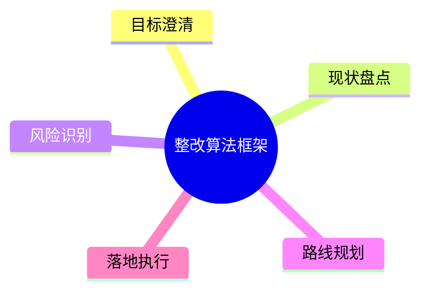
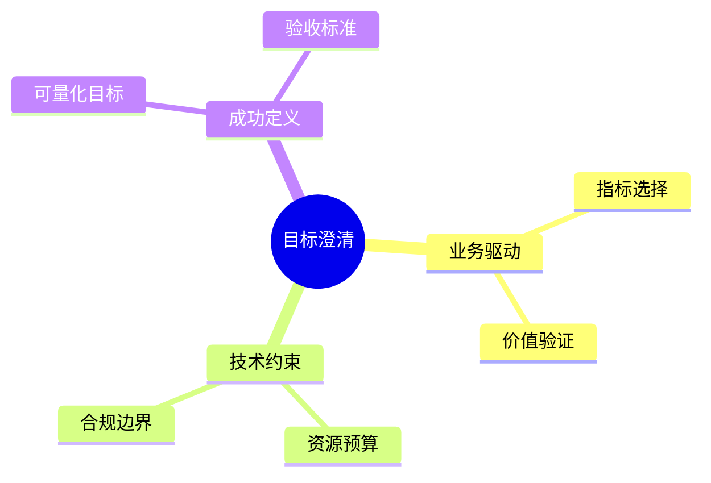
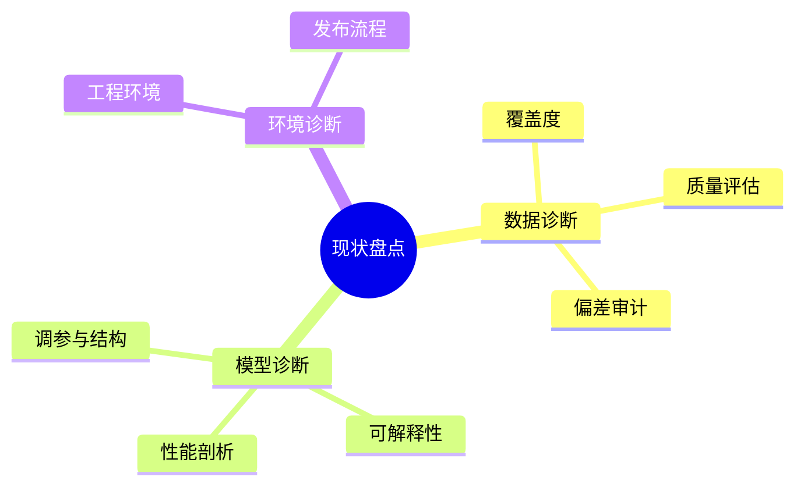
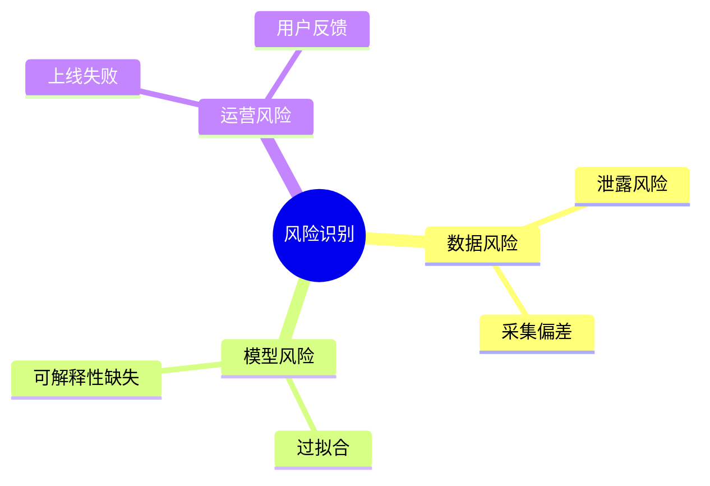
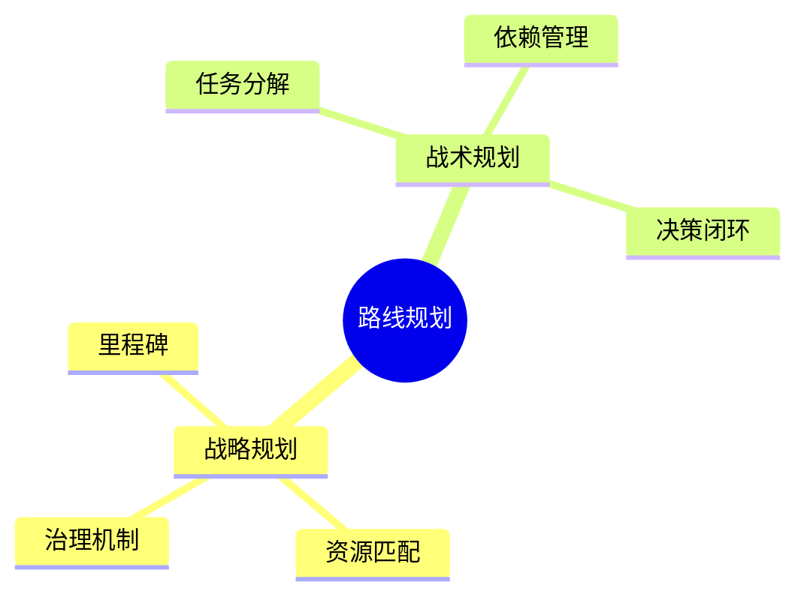
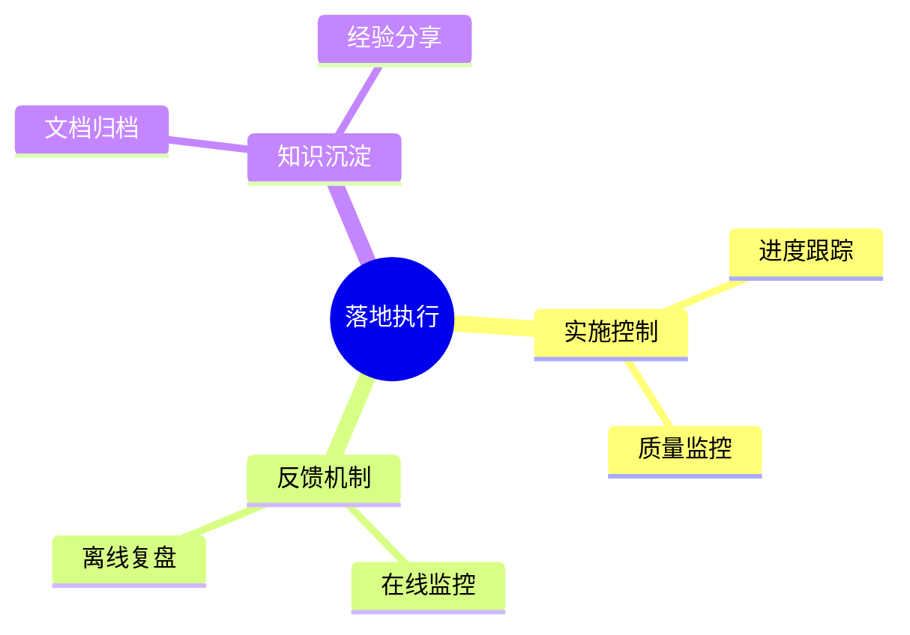

# 整改算法框架梳理文档

## 概述
整改算法框架旨在将现有模型的弱点系统性识别并制定精细化改进计划。本指南遵循费曼式讲解思路：先用通俗语言明确问题，再逐层深入解析机制和实践路径。

## 目标澄清
整改的第一步是确保目标与业务指标一致，避免“为改而改”。

- **业务驱动**：结合产品线关键指标（如召回率、转化率）明确整改方向。
- **技术约束**：识别算力、数据、法规等限制，提前预留缓冲。
- **成功定义**：使用可测量指标设置验收线，防止项目“永远进行中”。

## 现状盘点
通过数据与模型的双重体检，建立精细化的问题画像。

1. **数据诊断**：统计样本覆盖度、标注一致性，并针对偏差进行专项分析。
2. **模型诊断**：分解性能指标（整体、分层、分场景），结合 SHAP、LIME 等手段解析贡献因素。
3. **环境诊断**：检查工程流水线、自动化测试、上线回滚等配套机制是否完善。

## 风险识别与分级

- 使用 FMEA 或 Bow-Tie 分析法对风险进行概率 × 影响评估。
- 对高风险项设定针对性的缓解措施和监控指标。

## 路线规划
整改路线需要兼顾策略层和执行层，建议采用“双层规划”策略。

- **战略规划**：定义季度/阶段性里程碑，明确责任人和预算。
- **战术规划**：通过任务拆解表或甘特图展示依赖关系，建立每周的例会回顾制度。

## 落地执行与反馈闭环

1. **实施控制**：结合看板与自动化测试保障进度与质量。
2. **反馈机制**：线上部署需实时监控关键指标波动，线下周期性复盘。
3. **知识沉淀**：将关键决策、试验记录入知识库，形成标准化手册，降低团队对单一专家的依赖。

## 附录：执行节奏建议

- **周度节奏**：问题确认、短周期实验、结果评审。
- **月度节奏**：阶段复盘、资源调整、风险复审。
- **季度节奏**：战略目标对齐、跨部门协同检查。

通过以上结构化梳理，团队可以从“知道要改”跃迁到“知道怎么改、改到什么程度才算成功”，确保整改工作稳健推进。
