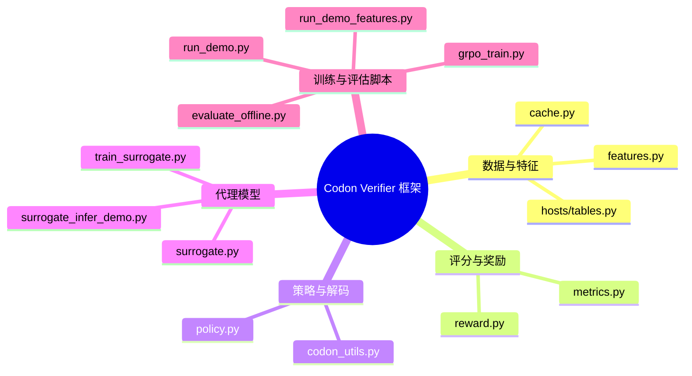

# 代码整体框架概览

本文档对 `codon_verifier` 扩展包的核心模块、数据流以及关键脚本进行整体梳理，帮助快速理解项目的职责分层与协作方式。

## 顶层模块划分

### 目录结构速览

- `codon_verifier/`：Python 包主体，按照“特征 → 评估 → 策略 → 训练”的顺序组织。
- `docs/`：背景设计与流程文档，本篇新增整体框架说明。
- `requirements.txt`：列出可选的科学计算与建模依赖，例如 `lightgbm`、`scikit-learn`。
- `ecoli_surrogate.pkl`：示例代理模型权重（可由 `train_surrogate.py` 重新训练）。

## 数据与特征模块

### `features.py`

- 提供 `FeatureBundle` 数据类，包装 AlphaFold、ESM、进化信息等外部特征。
- `assemble_feature_bundle` 负责将原始氨基酸序列与可选文件（PDB、NPZ、JSON）转化为统一的数值特征。
- 通过 `to_dict()` 输出的平铺字典，可直接送入奖励函数或代理模型。

### `cache.py`

- 使用 SHA256 派生键，将 `(AA 序列, 宿主)` 对应的特征缓存到本地 JSON，避免重复计算。
- `save_features` / `load_features` 与 `FeatureBundle` 联动，可支撑批量推理或训练前的数据预处理。

### `hosts/tables.py`

- 收录宿主特异的密码子使用频率与 tRNA 权重示例，目前内置 `E. coli`。
- 这些表被奖励函数、代理模型以及策略初始化共享，确保跨模块的一致性。

## 评分与奖励系统

### `metrics.py`

- 聚合 DNA 级别的基础指标（GC 含量、滑窗 GC、同聚物、重复序列）。
- 实现 CAI/tAI、稀有密码子检测、5′ 端结构代理分等典型可验证指标。
- `rules_score` 将各项指标归一化并加权合成 `total_rules`，同时返回子指标明细，为 RL 或离线评估提供解释性反馈。

### `reward.py`

- `combine_reward` 将代理模型输出的均值/方差与规则分数线性组合，实现
  
  \[ R = w_{\text{sur}} (\mu - \lambda \cdot \sigma) + w_{\text{rules}} \cdot \text{total\_rules} \]
- 支持禁忌位点的硬约束：若命中次数超过阈值，直接判定为非法并返回 `-inf` 奖励。
- 与策略采样和离线评估共享，保证单一实现贯穿训练与推理阶段。

#### 符号与术语速览（简明）

- `μ`：代理对表达量的稳健估计（中位数）。
- `σ`：不确定性，越大越不可信。
- `λ`：惩罚强度，越大越“保守”。
- `total_rules`：规则项的加权和，含 CAI/tAI、GC、结构、禁忌位点、多样性等。
- `w_sur` / `w_rules`：经验项/规则项权重。
- `硬约束`：命中禁忌位点等直接判非法，避免后续被错误奖励。

## 策略生成与解码

### `codon_utils.py`

- 定义标准遗传密码映射 (`AA_TO_CODONS` / `CODON_TO_AA`) 以及辅助函数：
  - `constrained_decode`：基于宿主使用频率的贪心/重采样解码，在线规避禁忌位点。
  - `sample_codon_for_aa`：温度控制的软采样，支持排除指定密码子。
  - `validate_cds`：训练与评估前的 CDS 合法性检查。
- 该模块被策略类、奖励函数及预处理脚本广泛引用，是 DNA 生成逻辑的底层基石。

### `policy.py`

- `HostConditionalCodonPolicy` 实现轻量级、宿主条件化的策略：
  - `params[host][AA][codon] = logit` 形式存储参数，初始化时使用宿主使用频率。
  - `sample_sequence` 逐位采样 DNA，支持在线 motif 过滤，与 `constrained_decode` 逻辑保持一致。
  - `update_from_samples` 按 GRPO 思路执行策略梯度更新，可选对参考策略做 L2 正则（近似 KL）。
- 该策略既可单独调试，也可嵌入更复杂的上层模型中充当占位实现。

## 代理模型（Surrogate）

### `surrogate.py`

- `build_feature_vector` 将 DNA 序列编码为数值向量，特征包含：长度、GC、窗口统计、CAI/tAI、结构代理、密码子直方图等。
- `SurrogateModel` 同时训练中位数回归器与高分位回归器，用差值近似不确定性 `sigma`：
  - 优先使用 LightGBM 的分位数回归，否则回退到 `GradientBoostingRegressor`。
  - 内置标准化与训练/验证集划分，并返回 R²、MAE 等诊断指标。
- `train_and_save` / `load_and_predict` 封装了端到端的训练与推理流程，供 CLI 脚本复用。

### CLI 支持

- `train_surrogate.py`：读取 JSONL 数据集并训练代理模型，输出训练指标和模型文件。
- `surrogate_infer_demo.py`：载入模型，对多条 DNA 计算 (μ, σ)，可用于调试或离线评估。

## 训练与评估脚本

### `grpo_train.py`

- 演示如何将策略、奖励与特征拼接成 GRPO 训练循环：
  - `group_relative_advantages` 计算组内归一化优势，避免价值网络。
  - 主循环中，策略针对氨基酸序列采样候选 DNA，并调用 `combine_reward` 获得奖励。
  - 定期刷新参考策略，模仿 DeepSeek-R1 的稳定化做法。

### `evaluate_offline.py`

- 针对给定 DNA 序列批量执行 `rules_score`，输出 JSON 摘要（CAI、GC、禁忌位点命中率等）。
- 适合快速比较不同优化策略产物的合规性与质量。

### `run_demo.py` 与 `run_demo_features.py`

- `run_demo.py`：最小可运行示例，串联约束解码与奖励计算，展示输出指标。
- `run_demo_features.py`：演示特征组装、缓存及奖励调用的整体流程，方便检验环境依赖。

## 典型数据流

1. **特征准备**：`assemble_feature_bundle` 生成结构/进化特征 → 可选落盘缓存。
2. **代理模型训练**：`train_surrogate.py` 构建数据集 → `SurrogateModel.fit` → 保存模型。
3. **策略采样**：`HostConditionalCodonPolicy.sample_sequence` 基于宿主表采样候选 DNA。
4. **奖励评估**：`combine_reward` 读取代理预测 (μ, σ) 与规则指标 → 输出总奖励与诊断信息。
5. **策略更新**：`grpo_train.py` 对采样结果计算优势并调用 `update_from_samples`。
6. **离线评估**：`evaluate_offline.py` 或外部分析脚本复用 `rules_score` 做批量指标统计。

上述流程确保“生成 → 评估 → 强化学习”闭环内的所有环节共享相同的特征定义与宿主配置，使得调试与部署更加一致。
